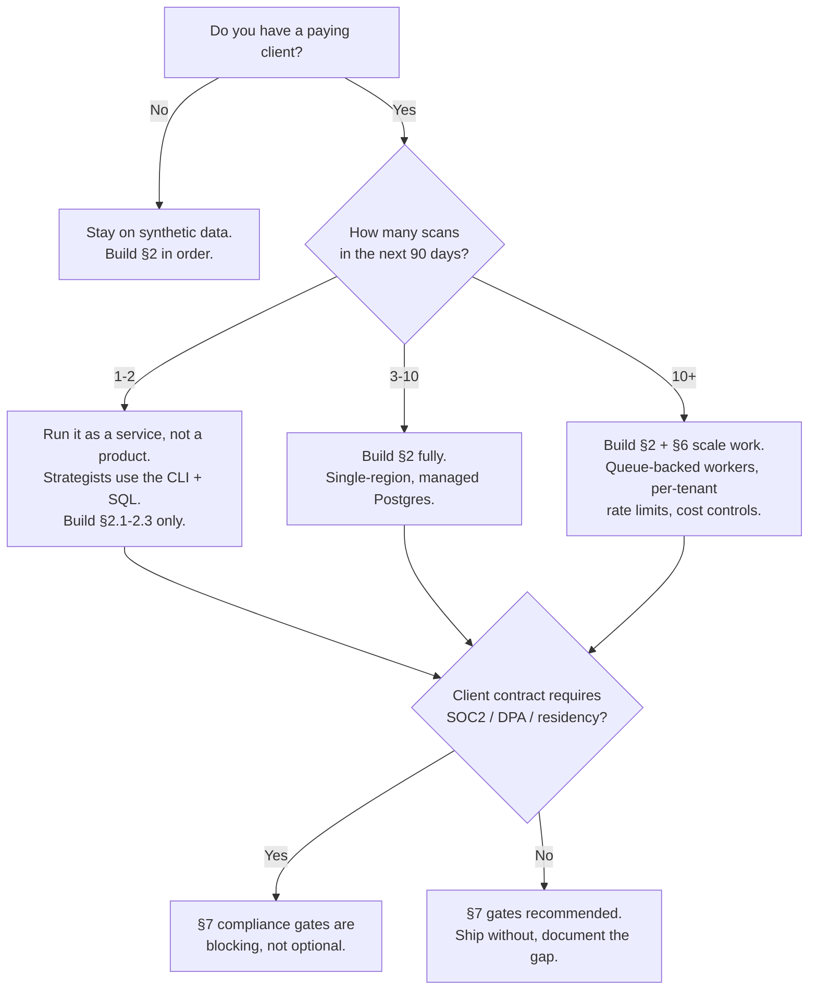
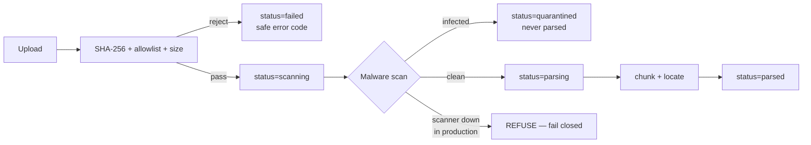
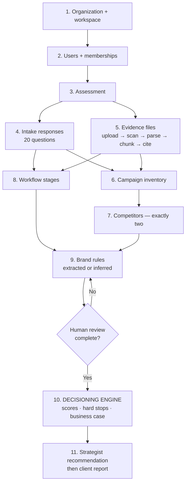
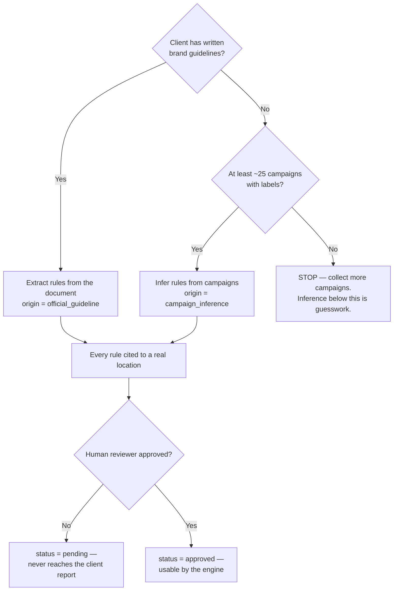
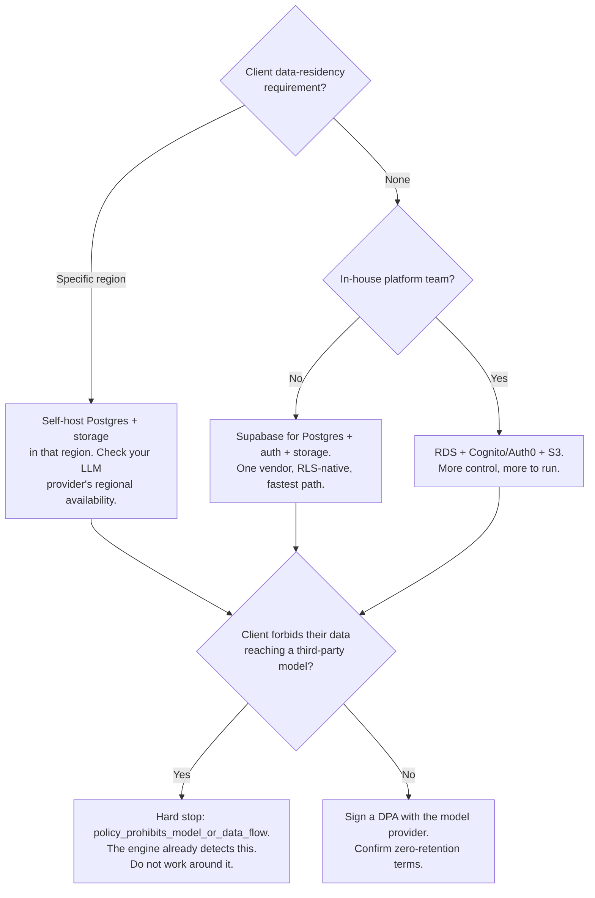

# How to go full-scale production

Taking SignalScan from the current repository to a system that ingests **real client evidence** and produces client-facing recommendations.

---

## 0. Read this first

The decisioning engine is finished. The pipeline that feeds it is not.

Everything downstream of "here is validated, cited evidence" — scoring, confidence, hard stops, business case, priority bands, tenant isolation — is built, tested and deterministic. Everything upstream — getting a client's documents in, parsing them, citing them, and turning them into brand rules and a workflow map — is specified but not written.

| Layer                                             | State | Where                                         |
| ------------------------------------------------- | ----- | --------------------------------------------- |
| Opportunity scoring, confidence, hard stops (§11) | ✅    | `packages/domain/src/scoring`                 |
| Business case (§12)                               | ✅    | `packages/domain/src/business-case`           |
| Intake question set and branching (§7)            | ✅    | `packages/domain/src/intake`                  |
| Workflow model and friction analysis (§8)         | ✅    | `packages/domain/src/workflow`                |
| Assessment lifecycle (§5.1)                       | ✅    | `packages/domain/src/assessment`              |
| Schema, RLS policies, audit trigger (§17)         | ✅    | `db/`                                         |
| Authorisation decisions (§4.2)                    | ✅    | `packages/security/src/authorization`         |
| Read-only scan page                               | ✅    | `apps/web`                                    |
| **Document parsing and chunking**                 | ❌    | `packages/documents` — does not exist         |
| **LLM and embedding adapters**                    | ❌    | `packages/ai` — does not exist                |
| **Report rendering and export**                   | ❌    | `packages/reports` — does not exist           |
| **Background jobs**                               | ❌    | `workers/` — does not exist                   |
| **Authentication**                                | ❌    | `AUTH_PROVIDER=local` is a stub               |
| **Object storage adapter**                        | ❌    | MinIO container exists; no code talks to it   |
| **Audit writer and retention sweep**              | ❌    | `packages/security` has authorisation only    |
| **Env validation at startup**                     | ❌    | `.env.example` names a module that is missing |

> **Do not point this at real client data until §2 is complete.** The security controls in `SECURITY.md` are enforced by code that has not been written yet. The database will isolate tenants correctly today; nothing else will.

### Should you go to production at all yet?

**The honest low-cost path is `D`.** For the first two or three clients, a strategist can run the scan with the engine as it stands: load evidence manually, run the scoring from a script, produce the report by hand. That earns the revenue that justifies building the rest — and it surfaces what the ingestion pipeline actually needs before you commit to a design.

---

## 1. Terminology

| Term           | Meaning                                                                      |
| -------------- | ---------------------------------------------------------------------------- |
| **Workspace**  | One client. The tenant boundary. RLS keys off membership of this.            |
| **Assessment** | One five-day scan for one client. All evidence is scoped to it.              |
| **Asset**      | One uploaded file.                                                           |
| **Chunk**      | A parsed slice of an asset, with a page/slide/sheet location.                |
| **Citation**   | An excerpt plus its exact location. Nothing reaches a client report uncited. |
| **Hard stop**  | A condition that blocks a recommendation regardless of score.                |

---

## 2. What must be built before real data — in order

Each step depends on the one before it. Do not parallelise past a missing dependency.

### 2.1 Startup config validation — MUST

`.env.example` promises that "blank values are validated at startup … the process fails closed". No such module exists. Build it first, because every control below depends on refusing to boot when misconfigured.

- Create `packages/domain/src/config/env.ts`, Zod-validated, parsed once at boot.
- **Fail closed in production** when: `LLM_PROVIDER !== 'mock'` and any model slot is empty (§21.6); `MALWARE_SCAN_ENABLED=true` and no scanner is configured; `AUTH_SECRET` empty; `STORAGE_PROVIDER` set with no credentials.
- Never default a model name in code.

### 2.2 Authentication and membership — MUST

Nothing today knows who is asking. The page renders the seeded assessment to anyone.

- Set `AUTH_PROVIDER=supabase`, populate `SUPABASE_URL`, `SUPABASE_ANON_KEY`, `SUPABASE_SERVICE_ROLE_KEY`.
- Connect the app as `signalscan_app`, **not** the schema owner, and issue `SET LOCAL app.current_user_id = '<uuid>'` per transaction. `tests/integration/tenant-isolation.test.ts` shows the exact pattern.
- Enforce `AUTH_ALLOWED_EMAIL_DOMAINS` for client invitations.
- Route every permission decision through `packages/security/src/authorization/permissions.ts`. A second implementation is a second chance to get it wrong.

> The service-role key bypasses RLS. It belongs in server-only code paths, never in anything the browser can reach.

### 2.3 Storage and upload safety — MUST

- Build a storage adapter behind `packages/documents`. Private bucket only; downloads via signed URLs (`STORAGE_SIGNED_URL_TTL_SECONDS`, default 900).
- On upload: compute SHA-256, enforce the extension allowlist, enforce `FILE_MAX_SIZE_MB` (50), `ASSESSMENT_MAX_FILE_COUNT` (200), `ASSESSMENT_MAX_STORAGE_MB` (2048).
- Reject double extensions (`brief.pdf.exe`) and MIME/extension mismatches.
- Set `retention_delete_at` **at upload time**, so the sweep never has to guess.
- Malware scanning must **fail closed** in production.

### 2.4 Document parsing and citation — MUST

- `packages/documents`: parsers per type, chunking, and a **real location** per chunk (page for PDF, slide for PPTX, sheet+cell for XLSX).
- Populate `asset_chunks.location_json`. A citation without a real location is not provenance.
- Follow **ADR 0012**: cited extraction runs as two passes — pass 1 uses Anthropic native citations to get verifiable `page_location`; pass 2 normalises to schema using only the citation ids pass 1 minted. A rule citing an id pass 1 did not mint is rejected outright.

### 2.5 LLM and embedding adapters — MUST

- `packages/ai`, behind an adapter interface. Business logic never imports a vendor SDK (§15.3).
- `LLM_PROVIDER=anthropic`, `LLM_API_KEY` set. Models per `.env.example`: extraction and generation on Opus 5, classification on Haiku 4.5.
- **Do not send `temperature`, `top_p` or `top_k`** — removed from current Claude models, returns HTTP 400. See **ADR 0011**; express determinism as effort instead.
- Embeddings: set `EMBEDDING_PROVIDER` and `EMBEDDING_MODEL` to match `vector(1536)` in `asset_chunks`, or migrate the column.
- Retrieval **must** filter `workspace_id` and `assessment_id` before vector similarity (§20.3).
- Wrap all retrieved content in explicit delimiters; treat it as data, never instructions (§22.2).
- Log every call to `model_invocations` — without content.

### 2.6 Jobs and workers — MUST

Parsing 200 documents does not belong in a request. Build `workers/` on `JOB_PROVIDER=inngest`, with `JOB_SIGNING_KEY` and `JOB_EVENT_KEY`. Respect `JOB_MAX_ATTEMPTS` (3) and `JOB_ANALYSIS_TIMEOUT_SECONDS` (1800). Record state in the `jobs` table.

### 2.7 Audit and retention — MUST

`audit_events` exists and is immutable; nothing writes to it outside the seed. Write one for every sensitive action listed in `SECURITY.md`. Build the retention sweep against `retention_delete_at`, driven by `RETENTION_CRON_SECRET`.

### 2.8 The intake and review UI — MUST

The current page is read-only. Production needs: the 20-question intake with branching, evidence upload, workflow validation, brand-rule approval, competitor confirmation, and the strategist recommendation gate.

### 2.9 Reports and export — SHOULD

`packages/reports` for HTML/PDF/CSV/JSON/Markdown. `PDF_RENDERER=chromium`, `EXPORT_LINK_TTL_SECONDS` (86400). Until this exists, deliver the readout manually — it is the least automatable and least risky gap.

### 2.10 Eval gates — SHOULD

`pnpm test:evals` runs but has no suite. Before live extraction, build the §26.5 gold sets, including adversarial fixtures (documents containing prompt injection). Gate: citation points to relevant evidence ≥ 90%.

---

## 3. What data goes in, in what format, and where

### 3.1 The ingestion order

The order is not a preference — later stages read earlier ones, and foreign keys enforce most of it.

**Step 10 is the handover point.** Everything before it is collection and human validation. The engine will happily score thin evidence — it will just return low confidence and say so. Feeding it unvalidated input produces a defensible-looking number built on nothing.

### 3.2 Evidence files

| Property     | Value                                                                       | Enforced by                 |
| ------------ | --------------------------------------------------------------------------- | --------------------------- |
| Formats      | `pdf docx pptx txt md csv xlsx png jpg jpeg webp`                           | `ALLOWED_FILE_EXTENSIONS`   |
| Max per file | 50 MB                                                                       | `FILE_MAX_SIZE_MB`          |
| Max count    | 200 per assessment                                                          | `ASSESSMENT_MAX_FILE_COUNT` |
| Max total    | 2048 MB per assessment                                                      | `ASSESSMENT_MAX_STORAGE_MB` |
| Lands in     | Private bucket → `input_assets` row → `asset_chunks` → `evidence_citations` | §6.3                        |

Every file **must** be tagged with a category, because the analysis routes on it:

`brand_guideline` · `campaign_brief` · `campaign_asset` · `campaign_performance` · `process_document` · `tool_export` · `policy_document` · `competitor_evidence` · `interview_note` · `other`

### 3.3 Campaign inventory

Roughly 25 recent campaigns. CSV or spreadsheet, one row per campaign, loaded into `campaigns`:

| Column             | Type         | Required | Notes                                               |
| ------------------ | ------------ | -------- | --------------------------------------------------- |
| `title`            | text         | **Yes**  |                                                     |
| `campaign_date`    | `YYYY-MM-DD` | No       | Needed for recency in confidence scoring            |
| `product`          | text         | No       |                                                     |
| `market`           | text         | No       |                                                     |
| `audience`         | text         | No       |                                                     |
| `objective`        | text         | No       |                                                     |
| `channels`         | text array   | No       | e.g. `email;paid_social;web`                        |
| `brand_label`      | enum         | No       | `on_brand` \| `off_brand` \| `neutral` \| `unknown` |
| `performance_json` | jsonb        | No       | Only if the client shares metrics                   |

**At least 3 `on_brand` and 2 `off_brand` labels are needed** for brand inference to have anything to contrast. Without labels, inference quality collapses — ask the client to label, do not guess.

### 3.4 Intake responses

20 questions across five groups, loaded into `question_responses` against a versioned `question_definitions` row. Question ids are stable and defined in `packages/domain/src/intake/questions.ts`:

| Group      | Covers                                                        |
| ---------- | ------------------------------------------------------------- |
| `business` | priority outcome, focus scope, campaign type, success measure |
| `flow`     | trigger, stages, roles, slowest stages, rework, repeated work |
| `data`     | systems, quality, monthly volume, current cost                |
| `brand`    | guidelines available, examples, competitors                   |
| `risk`     | controls, AI policy, pilot roles                              |

Four of these feed the business case directly — `data.monthly_volume` and `data.current_cost` become `monthlyWorkflowVolume` and `loadedHourlyCost`. **If the client will not share cost data, the business case returns `null` and reports what it is waiting on.** That is correct behaviour, not a failure; do not substitute an industry benchmark.

Responses must reach `status='confirmed'` — answered by the operator, confirmed by the sponsor — before analysis.

### 3.5 Competitors

**Exactly two** (§9.3), in `competitors`, each requiring `name`, `official_url`, `rationale`, and `status='confirmed'` by the client sponsor. Evidence is public material only, eight observation axes each, into `competitor_observations`.

> Never scrape anything behind a login or a paywall. `observation_date` is required so a stale claim can be spotted.

### 3.6 Workflow map

Nine to twelve stages depending on the template — `general_campaign` has 10, `b2b_product_launch` 12 — normalised to the ten-stage schema in `DEFAULT_NORMALIZED_STAGES` and written to `workflow_stages` with `variant='observed'`. Each stage carries `work_time_minutes`, `elapsed_time_minutes`, `wait_time_minutes` and `rework_frequency`. Three capture paths (`template`, `evidence`, `interview`) normalise to one schema.

**Every stage must reach `status='operator_validated'`.** The gap between elapsed and work time is the entire finding; a stage with guessed timings produces a fabricated one.

### 3.7 Brand rules — which route?

Inferred rules stay `pending` until a named reviewer approves them (§32.2). This is a release gate, not a nicety.

---

## 4. Integrations, keys and dependencies

### 4.1 Must have

| Capability          | Setting                                                      | Notes                                                          |
| ------------------- | ------------------------------------------------------------ | -------------------------------------------------------------- |
| Postgres + pgvector | `DATABASE_URL`, `DATABASE_DIRECT_URL`                        | Supabase or RDS. Pooled URL for the app, direct for migrations |
| LLM                 | `LLM_PROVIDER=anthropic`, `LLM_API_KEY`                      | Plus all four `LLM_MODEL_*` slots — never defaulted in code    |
| Embeddings          | `EMBEDDING_PROVIDER`, `EMBEDDING_MODEL`, `EMBEDDING_API_KEY` | Must be 1536-dimension or migrate the column                   |
| Auth                | `AUTH_PROVIDER=supabase`, `AUTH_SECRET`, `SUPABASE_*`        | Service-role key is server-only                                |
| Storage             | `STORAGE_PROVIDER`, bucket, credentials                      | Private bucket, signed URLs only                               |
| Malware scanning    | `MALWARE_SCAN_PROVIDER`, `MALWARE_SCAN_API_KEY`              | **Fails closed** — no scanner, no boot                         |
| Jobs                | `JOB_SIGNING_KEY`, `JOB_EVENT_KEY`                           | Inngest or equivalent                                          |
| Email               | `EMAIL_PROVIDER`, `EMAIL_API_KEY`                            | Invitations and export links                                   |
| Secret store        | —                                                            | Deployment secret manager. Never in the repo                   |

### 4.2 Should have

| Capability     | Setting                       | Why                                               |
| -------------- | ----------------------------- | ------------------------------------------------- |
| Error tracking | `ERROR_TRACKING_DSN`          | Scrub client content before it leaves the process |
| Tracing        | `OTEL_EXPORTER_OTLP_ENDPOINT` | Analysis jobs are long and multi-step             |
| PDF rendering  | `PDF_RENDERER_URL`            | Only if you export PDFs                           |
| Retention cron | `RETENTION_CRON_SECRET`       | Required if you promise a retention window        |

### 4.3 Optional

Product analytics (`ANALYTICS_*`, off by default — §24.1 restricts properties severely), a hosted vector database (pgvector handles this scale comfortably), a CDN, and multi-region.

### 4.4 Choosing providers

---

## 5. Deployment

1. **Three environments.** Production, staging, local. **Staging uses synthetic data only** (§28.1) — never copy production evidence into it.
2. **Migrations** run as the schema owner via `DATABASE_DIRECT_URL`, in CI, before the deploy. Already idempotent and checksum-guarded.
3. **The app connects as `signalscan_app`** through the pooled URL. If the app can bypass RLS, RLS is decoration.
4. **Never run `pnpm db:seed` against production.** It deletes fixture organisations and disables the audit trigger for its cleanup transaction. Gate it on `APP_ENV !== 'production'`.
5. **Backups**: point-in-time recovery on, plus a restore rehearsal. An untested backup is a hope.
6. **CI gates**: lint, format, typecheck, coverage (100% branch on scoring), migrations, integration, build, evals, secret scan over full history.

---

## 6. Scale

At ten-plus scans per quarter the binding constraints are cost and job throughput, not queries.

- **Token cost dominates.** 200 documents × two-pass extraction is the whole bill. Use prompt caching on the stable assessment prefix (ADR 0012), route classification to Haiku, and cap spend per assessment.
- **Parsing is CPU-bound.** Scale workers horizontally; keep `JOB_ANALYSIS_TIMEOUT_SECONDS` honest.
- **pgvector is fine here.** Thousands of chunks per assessment, not millions. Add an HNSW index when a query exceeds ~100 ms; do not add a vector vendor before that.
- **Per-tenant rate limits** on upload and analysis, so one client cannot starve another.

---

## 7. Before the first real client

Blocking, in the sense that a client contract will require them:

- [ ] §26.4 security tests pass: cross-workspace access, storage URL guessing, expired signed URLs, privilege escalation, malicious file types and double extensions, oversize files, prompt injection in documents, XSS, SQL injection, CSRF/replay
- [ ] Penetration test by someone who did not write the code
- [ ] DPA signed with every subprocessor, including the model provider, with zero-retention terms confirmed
- [ ] Retention window agreed in writing and the sweep proven to actually delete — storage objects included
- [ ] Deletion request path proven end to end
- [ ] Audit events written for every action in `SECURITY.md`
- [ ] Incident response runbook with a named owner
- [ ] Restore-from-backup rehearsed
- [ ] `LICENSE` reviewed — currently proprietary on a public repository

Recommended: SOC 2 Type I, a public sub-processor list, and per-assessment cost alerting.

---

## 8. Realistic sequencing

Order, not estimates — estimates depend on the team.

| Phase | Delivers                                           | Unblocks                          |
| ----- | -------------------------------------------------- | --------------------------------- |
| 1     | §2.1 config validation, §2.2 auth, §2.3 storage    | Any real file touching the system |
| 2     | §2.4 parsing + citations, §2.5 adapters, §2.6 jobs | Automated evidence → cited chunks |
| 3     | §2.7 audit + retention, §2.8 intake and review UI  | Clients using it unaided          |
| 4     | §2.9 reports, §2.10 evals, §7 gates                | Contractual production            |

**Phases 1–2 are where the risk is.** Once evidence is cited and validated, the engine already works — that half is done, tested and reproducible.

---

## 9. Principles that must survive contact with production

Every one of these is enforced by code or schema today. Do not let a deadline erode them.

- **No model ever produces a score, a band, or a business-case figure.** The scoring package has no model dependency; keep it that way.
- **Missing values stay missing.** No estimate, no benchmark, no placeholder.
- **Hard stops beat scores**, always.
- **Nothing reaches a client report uncited.**
- **Tenant isolation lives in the database**, never in a `WHERE` clause.
- **Uploaded content is data, never instructions.**
- **A human approves every recommendation.**

The value of this system is that a client can be shown exactly why a number is what it is. Every shortcut above trades that away, and it does not grow back.
